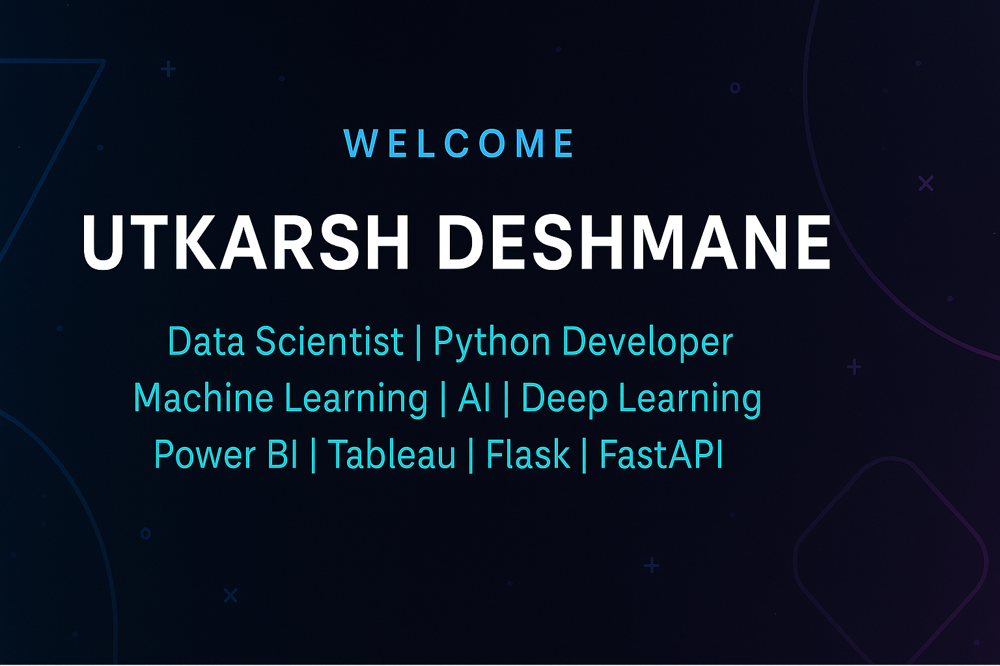

  

<h1 align="center">Hi 👋, I'm Utkarsh Deshmane</h1>
<h3 align="center">Aspiring Data Scientist | Python Developer | AI & Data Science Graduate</h3>

  

---

### 🧑‍💻 About Me
I'm a data enthusiast who loves building intelligent systems that uncover insights from data and solve real-world problems. From automating price tracking to designing real-time stock assistants, I bring creativity and precision to data-driven applications.

- 💡 Proficient in **Python, SQL, and Machine Learning**
- ⚙️ Hands-on experience with **FastAPI, Flask, and Streamlit**
- ☁️ Comfortable working with **AWS, Docker, and GitHub Actions**
- 🧠 Always exploring **MLOps, LLMs**, and new tech trends

---

### 🛠️ Skills & Tools

#### Languages & Libraries  
`Python` `SQL` `Pandas` `NumPy` `Scikit-Learn` `TensorFlow` `OpenCV` `Matplotlib` `Seaborn`

#### Web & Cloud  
`Flask` `FastAPI` `Streamlit` `Gunicorn` `Docker` `AWS` `GitHub Actions`

#### Databases & Dev Tools  
`MongoDB` `MySQL` `SQLite` `Git` `Jupyter Notebook` `VS Code`

#### Visualization  
`Power BI` `Tableau` `Excel`

---

### 🚀 Projects

**📈 AI Stock Analysis (FastAPI + Gemini Pro)**  
→ Conversational stock Q&A assistant using yFinance and Google Gemini  
**🛍️ Ajio Price Tracker (Flask + Telegram Bot)**  
→ Price drop notifications via web scraping & Telegram alerts  
**🧱 DWELL – Wall Crack Detection (CNN + Streamlit)**  
→ Real-time crack detection using trained CNN model  

---

### 🏢 Internships

**🔍 Data Analyst Intern – Cravita Technologies, Pune**  
*Dec 2024 – Feb 2025*  
- Developed Power BI dashboards for financial insights  
- Analyzed trends in large datasets  
- Improved SQL query efficiency

---

### 🎓 Education

**B.E. – Artificial Intelligence & Data Science**  
Savitribai Phule Pune University | 2021–2024 | GPA: 7.14 / 10

**Diploma in Computer Engineering**  
MSBTE | 2016–2021 | Score: 88.23%

---

### 📜 Certifications

- 🧠 *Data Analytics* – Fortune Cloud Technologies (2024)
- 🐍 *Python for Data Science* – Udemy (2023)

---

### 📊 GitHub Stats

  
  

---

### 📬 Connect With Me

  
  
  

---

<i>“Turning data into decisions through code and creativity.”</i>

