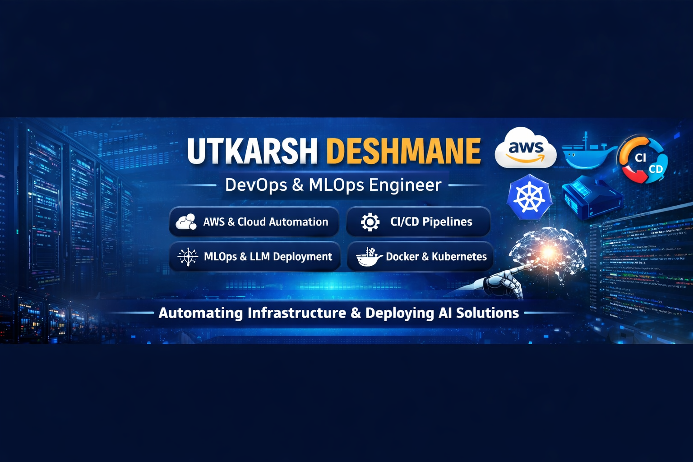

  

<h1 align="center">Hi 👋, I'm Utkarsh Deshmane</h1>
<h3 align="center">DevOps Engineer | MLOps Engineer | AWS | CI/CD | Docker | Kubernetes</h3>

  

---

### 🚀 About Me

DevOps & MLOps Engineer with 2+ years of experience in building scalable CI/CD pipelines, automating cloud infrastructure, and deploying containerized applications on AWS.

- ⚙️ Strong in **CI/CD (Jenkins, GitHub Actions)**
- ☁️ Hands-on with **AWS (EC2, S3, IAM, VPC, Lambda, ECR)**
- 🐳 Experience in **Docker & Kubernetes**
- 🧠 Worked on **LLM-based systems (RAG, LangChain, AI pipelines)**
- 🛠️ Skilled in **Python automation & FastAPI-based services**

---

### 🛠️ Tech Stack

#### DevOps & Cloud  
`AWS` `Docker` `Kubernetes` `Jenkins` `GitHub Actions` `Terraform`

#### Programming & Automation  
`Python` `Bash` `FastAPI` `REST APIs`

#### Monitoring & Tools  
`CloudWatch` `Linux` `Git` `Nginx` `Postman` `Jira`

#### AI / MLOps  
`LLM` `LangChain` `RAG` `Model Deployment`

---

### 🚀 Featured Projects

#### 🔥 DevOps Automation Agent
- Automated AWS infrastructure management (EC2, ECR, IAM, SSM)
- Built FastAPI-based system to trigger DevOps workflows
- Automated Docker build, push, and deployment pipelines

#### 🤖 AI Model Deployment Pipeline
- CI/CD pipeline for ML model deployment
- Integrated GitHub + Jenkins automation
- Reduced manual deployment effort

#### ☁️ Multi-Tier AWS Deployment
- Designed scalable architecture using EC2 & VPC
- Implemented CI/CD pipelines for automated deployment
- Secured infrastructure with IAM & security groups

#### ⚡ Serverless Backend System
- Built cost-optimized AWS Lambda + EC2 architecture
- Implemented auto start/stop system to reduce costs
- Used Nginx reverse proxy with Docker containers

---

### 📊 GitHub Stats

  
  

---

### 📬 Connect With Me

  
  
  

---

<i>“Automating infrastructure, scaling systems, and deploying intelligence.”</i>
****
